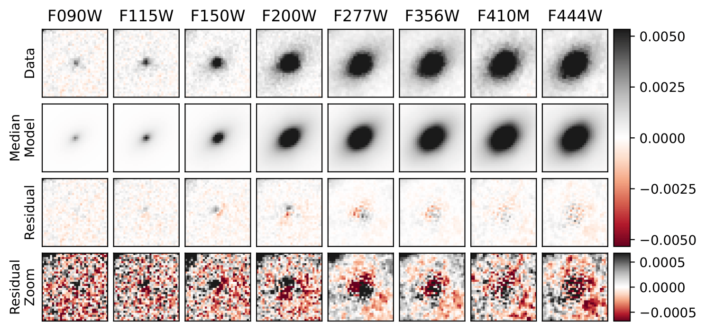

**Mimical** (**M**\odelling the **I**\ntensity of **M**\ultiply-**I**\maged **C**\elestial **A**\ncient **L**\ight)

Mimical is an intensity modelling code for multiply-imaged objects, performing simultaenous Bayseian inference of model parameters via the nested sampling algorithm. Mimical supports any astropy 2D model, and supports user defined parameter polynomial depenency with image wavelength.

**Installation**

Mimical can be installed with pip:

.. code::

    pip install mimical

**Required input**

#. ``images`` - 3D image array with dimensions (N\ :sub:`filters`\, N\ :sub:`y`\, N\ :sub:`x`\)
#. ``filt_list`` - An array of paths to filters curves of dimension N\ :sub:`filters`\
#. ``psfs`` - 3D PSF array with dimensions (N\ :sub:`filters`\, M\ :sub:`y`\, M\ :sub:`x`\)
#. ``mimical_prior`` - A Mimical prior

**Mimical prior**

Below is an example ``mimical_prior`` for a run using the default astropy sersic model. The first set of element keys must match 
the astropy model parameter names. Following this, the next element, named ``psf_pa``, traces the rotation of the PSF.
The final two elements must be named ``rms`` and ``flux_to_counts``. The ``rms`` parameter traces the RMS noise in the image; 
this can be fit with Mimical but it is **highly recommended to provide it** to reduce dimensionality 
(see **Fixing parameters**). This is likewise for ``flux_to_counts``, which helps Mimical calculate the poisson uncertainty associated
with the generated model; this can be easily provided by the user with information on the gain and exposure time.

``mimical_prior = {}``

| ``mimical_prior['amplitude'] = ((0, 10*images.max()), 'Individual')``
| ``mimical_prior['r_eff'] = ((0, images.shape[2]), 'Polynomial', 1)``
| ``mimical_prior['n'] = ((0.1, 10), 'Polynomial', 1)``
| ``mimical_prior['x_0'] = ((images.shape[2]/2-2, images.shape[2]/2+2), 'Polynomial', 0)``
| ``mimical_prior['y_0'] = ((images.shape[1]/2-2, images.shape[1]/2+2), 'Polynomial', 0)``
| ``mimical_prior['ellip'] = ((0,0.75), 'Polynomial', 0)``
| ``mimical_prior['theta'] = ((0, np.pi), 'Polynomial', 0)``

| ``mimical_prior['psf_pa'] = ((-180, 180), 'Polynomial', 0)``

| ``mimical_prior['rms'] = ((0,1), 'Individual')``
| ``mimical_prior['flux_to_counts'] = ((1,1e6), 'Individual')``
|

**Optional input and parameters**

* ``astropy_model = Sersic2D()`` - Any astropy 2D model
* ``pool = None`` - Number of cores to parallelise likelihood calculations to
* ``sampler = 'Nautilus'`` - The nested sampler to use, other options include ``Dynesty``
* ``oversample_boxlength = 15`` - Length of box in the centre of the image to perform oversampling in
* ``oversample_factor = 10`` - Factor by which to oversample inside the above box
* ``sextractor_clean = False`` - Whether or not to let Sextractor clean the images of other objects
* ``sextractor_target_maxdistancepix='default'`` - Radius from the image centre at which Sextractor discards the closest object as contamination. Needed for when the target object is undetected.

**Fixing parameters**

You can fix any of the parameters in the Mimical prior by setting the first element in the parameter tuple equal to either a float / int / list / ndarray. For instance, to keep ``x_0`` constant across all images, one would pass a float/int and choose the options ``('Polynomial', 0)``. Or, to supply the ``RMS`` for each image separately, one would pass a list/ndarray of length N\ :sub:`filters`\  and choose the options ``(Individual)``.

**Workflow diagram**

.. image:: docs/mimical_workflow.png

